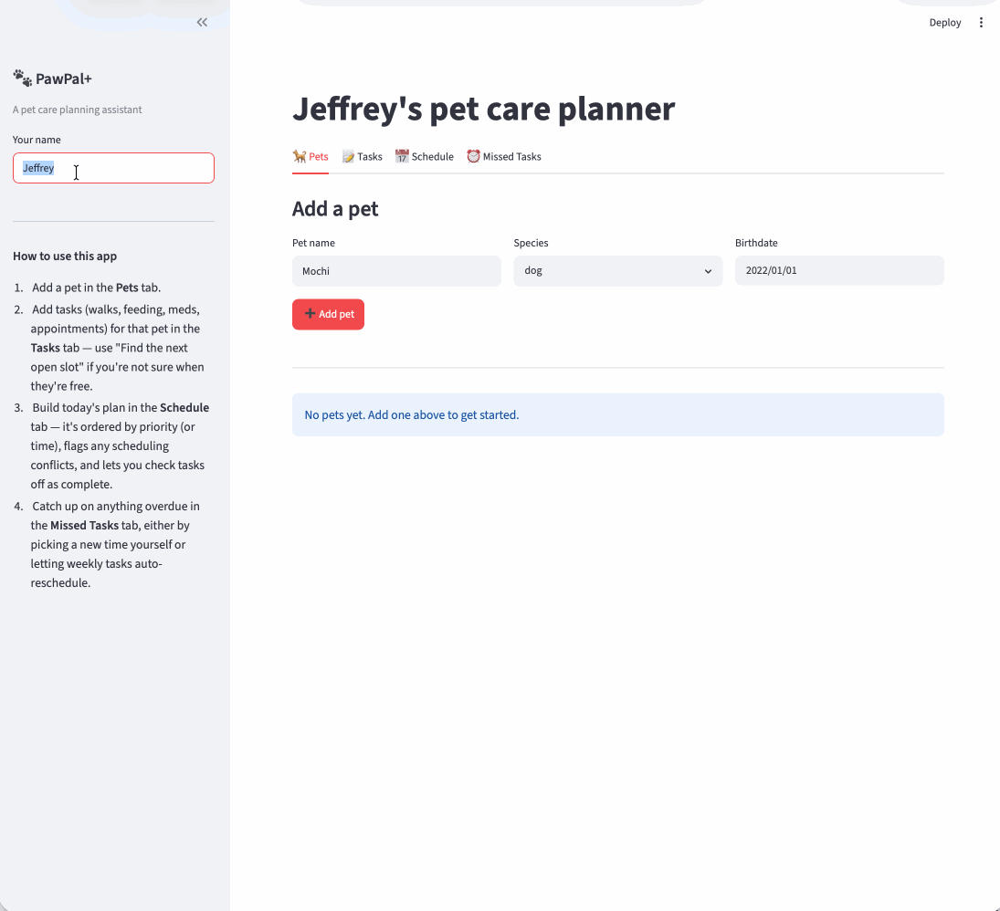

# 🐾 PawPal+

**PawPal+** is a pet care planning assistant. It helps a pet owner stay consistent with day-to-day care — walks, feeding, medication, appointments — by tracking tasks per pet and building a prioritized, conflict-checked daily plan.

A backend logic layer (`pawpal_system.py`) models owners, pets, and recurring/one-off tasks, and a `Scheduler` turns them into an ordered plan for any given day — flagging scheduling conflicts, surfacing missed tasks, and finding open time slots. That logic is exposed two ways: a Streamlit app (`app.py`) for interactive use, and a CLI demo script (`main.py`) for a quick terminal walkthrough.

## ✨ Features

- **Priority-first daily planning** — `Scheduler.build_daily_plan()` / `build_daily_plan_for_owner()` order tasks by priority (HIGH → LOW), chronologically by start time as a deterministic tie-break within a priority tier, and (optionally) truncate the plan to fit a `time_budget_minutes` window.
- **Sorting by time** — `Scheduler.sort_by_time()` gives a plain chronological "what happens when" view, as an alternative to the priority-first plan.
- **Conflict warnings** — `Scheduler.detect_conflicts()` / `get_conflict_warnings()` flag two tasks whose time windows *strictly* overlap (back-to-back tasks that merely touch are not a conflict), across every pet an owner has, and produce ready-to-display warning strings.
- **Daily & weekly recurrence** — `Task.occurs_on()` / `next_occurrence_date()` expand a single `Task` template into dated occurrences on demand (respecting an optional `recurrence_end_date` and midnight-rollover tasks that span two days), so recurring tasks don't need to be duplicated in storage.
- **Per-date completion tracking** — completing one occurrence of a recurring task (e.g. today's walk) doesn't silently mark the entire series done.
- **Filtering** — `Scheduler.filter_occurrences()` narrows a plan by pet name and/or completion status.
- **Missed-task recovery** — `Scheduler.get_missed_tasks()` surfaces overdue, uncompleted occurrences so they can be rescheduled via `Task.reschedule()` instead of silently vanishing.
- **Next available slot** — `Scheduler.find_next_available_slot()` finds the earliest free window of a given length on a given date within an optional `earliest`/`latest` bound, correctly collapsing overlapping busy windows instead of stopping at the first one's end.

## Getting started

### Setup

```bash
python -m venv .venv
source .venv/bin/activate  # Windows: .venv\Scripts\activate
pip install -r requirements.txt
```

### Running the app

```bash
streamlit run app.py
```

### Running the CLI demo

`main.py` is a terminal-only walkthrough of the backend logic (no UI) — useful for a quick sanity check or for seeing the `Scheduler`'s output directly:

```bash
python main.py
```

## 📐 System Design (UML)

Class diagram reflecting the final implementation in `pawpal_system.py` (source: [`diagrams/uml_final.mmd`](diagrams/uml_final.mmd); earlier draft: [`diagrams/uml.mmd`](diagrams/uml.mmd)):


## 🧪 Testing PawPal+

```bash
# Run the full test suite:
python -m pytest

# Run with coverage:
pytest --cov
```

The suite in `tests/test_pawpal.py` covers:

- **Task completion**: marking an occurrence complete updates its per-date status without affecting other dates.
- **Recurrence logic**: `next_occurrence_date` for DAILY and WEEKLY tasks (including from a non-anchor weekday), `None` for one-off tasks and once `recurrence_end_date` is exceeded, and that marking a daily task complete advances to the next day's date without retroactively completing that next occurrence.
- **Sorting**: `Scheduler.sort_by_time()` returns occurrences in chronological order regardless of the order tasks were added.
- **Conflict detection**: `Scheduler.detect_conflicts()` flags two tasks scheduled at the exact same time, and correctly ignores back-to-back tasks that touch but don't overlap.
- **Pet/task management**: adding a task increases a pet's task count.
- **Priority scheduling**: `build_daily_plan` orders HIGH before MEDIUM regardless of time, and breaks same-priority ties chronologically (not alphabetically).
- **Next available slot**: correctly skips a busy window, collapses two *overlapping* busy windows into one gap instead of reporting a false opening between them, and returns `None` when a pet's day is fully booked.
- **Missed-weekly recovery**: recovers an isolated missed occurrence without disturbing the rest of the series, falls back to shifting the whole series when there's no room, respects `recurrence_end_date`, and rejects a non-`WEEKLY` task.

Sample test output:

```
============================= test session starts ==============================
platform darwin -- Python 3.12.0, pytest-9.0.3, pluggy-1.6.0
rootdir: /Users/bagheera/repos/codepath/Codepath_AI_110/Week05/ai110-module2show-pawpal-starter
plugins: anyio-4.13.0
collecting ... collected 18 items

tests/test_pawpal.py::test_mark_complete_changes_task_status PASSED      [  5%]
tests/test_pawpal.py::test_add_task_increases_pet_task_count PASSED      [ 11%]
tests/test_pawpal.py::test_next_occurrence_date_daily_is_timedelta_of_one_day PASSED [ 16%]
tests/test_pawpal.py::test_next_occurrence_date_weekly_matches_anchor_weekday PASSED [ 22%]
tests/test_pawpal.py::test_next_occurrence_date_none_when_recurrence_none_or_end_date_exceeded PASSED [ 27%]
tests/test_pawpal.py::test_mark_complete_returns_next_occurrence_date PASSED [ 33%]
tests/test_pawpal.py::test_sort_by_time_returns_chronological_order PASSED [ 38%]
tests/test_pawpal.py::test_daily_recurrence_marks_today_complete_without_completing_tomorrow PASSED [ 44%]
tests/test_pawpal.py::test_detect_conflicts_flags_overlapping_duplicate_times PASSED [ 50%]
tests/test_pawpal.py::test_detect_conflicts_ignores_back_to_back_tasks PASSED [ 55%]
tests/test_pawpal.py::test_build_daily_plan_orders_by_priority_then_start_time PASSED [ 61%]
tests/test_pawpal.py::test_find_next_available_slot_skips_busy_windows PASSED [ 66%]
tests/test_pawpal.py::test_find_next_available_slot_collapses_overlapping_busy_windows PASSED [ 72%]
tests/test_pawpal.py::test_find_next_available_slot_returns_none_when_fully_booked PASSED [ 77%]
tests/test_pawpal.py::test_auto_reschedule_missed_weekly_recovers_single_occurrence_without_shifting_series PASSED [ 83%]
tests/test_pawpal.py::test_auto_reschedule_missed_weekly_shifts_series_when_no_room_before_next_occurrence PASSED [ 88%]
tests/test_pawpal.py::test_auto_reschedule_missed_weekly_returns_none_when_recurrence_ended PASSED [ 94%]
tests/test_pawpal.py::test_auto_reschedule_missed_weekly_rejects_non_weekly_task PASSED [100%]

============================== 18 passed in 0.01s ==============================
```

### Known gaps

All 18 tests pass, covering the core scheduling behaviors (recurrence, sorting, conflict detection, completion tracking, priority-then-time ordering, next-available-slot finding, missed-weekly recovery) and the edge cases that are easiest to get wrong (touching-vs-overlapping windows, per-date completion, non-anchor weekday lookups, overlapping busy windows collapsing correctly). Not yet covered by an automated test: `build_daily_plan`'s `time_budget_minutes` cutoff, multi-pet conflict detection via `build_daily_plan_for_owner`, and `get_missed_tasks` itself (its underlying logic is exercised indirectly through the `auto_reschedule_missed_weekly` tests, but it has no dedicated test of its own).

## 📐 Smarter Scheduling

| Feature | Method(s) | Notes |
|---------|-----------|-------|
| Task sorting | `Scheduler.sort_by_time()`, `Scheduler._finalize_plan()` (used by `build_daily_plan`/`build_daily_plan_for_owner`) | `_finalize_plan` orders a daily plan by priority (HIGH first), then chronologically by `start_time` as the tie-break within a tier, and applies an optional `time_budget_minutes` greedy cutoff. `sort_by_time()` gives a plain chronological view of *all* occurrences (ignoring priority entirely) for when the owner wants "what happens when" instead of "what matters most". |
| Filtering | `Scheduler.filter_occurrences()` | Narrows a list of `TaskOccurrence`s by `pet_name` and/or `completed` status (combinable with AND). Completed occurrences are also dropped automatically inside `_finalize_plan`, so a daily plan never needs a separate filter step for that case. |
| Conflict handling | `Scheduler.detect_conflicts()`, `Scheduler.get_conflict_warnings()` | `detect_conflicts()` returns pairs of `TaskOccurrence`s whose time windows strictly overlap (touching, not overlapping, doesn't count; two occurrences of the *same* task are never compared). Works across pets, not just within one. `get_conflict_warnings()` wraps it into ready-to-print warning strings (e.g. `"Warning: Mochi's 'Morning walk' (08:00 AM) overlaps Mochi's 'Photo session' (08:00 AM)"`) so a caller never has to crash or hand-format a conflict. |
| Recurring tasks | `Task.window_on()`, `Task.occurs_on()`, `Task.next_occurrence_date()`, `Scheduler.expand_recurring()` | A recurring `Task` is one template object — `window_on`/`occurs_on` compute on demand whether it has an occurrence on a given date (respecting `DAILY`/`WEEKLY` cadence, `recurrence_end_date`, and midnight rollover), rather than persisting a new `Task` per occurrence. `next_occurrence_date(after)` reports the next due date (e.g. `today + timedelta(days=1)` for daily) and is returned by `Task.mark_complete()`/`TaskOccurrence.mark_complete()` so completing today's instance immediately surfaces what's next. |
| Next available slot | `Scheduler.find_next_available_slot()` | Given a pet, date, and required duration, walks that pet's busy windows (sorted by start time) and returns the earliest gap that fits, bounded by an optional `earliest`/`latest` time-of-day window. Tracks the *furthest* busy end time seen so far rather than each occurrence's own end time, so two overlapping occurrences (e.g. a vet visit and a grooming appointment that overlap each other) don't cause it to report a false gap between them. Returns `None` if nothing fits before `latest`. |
| Missed-weekly recovery | `Scheduler.auto_reschedule_missed_weekly()` | Two-phase recovery for a missed `WEEKLY` occurrence: tries a conflict-checked isolated makeup slot before the series' next natural date first (least disruptive), and only shifts the whole series anchor via `Task.reschedule()` if no such slot exists. Capped by `max_days_ahead` so a fully-booked, open-ended series can't search forever. Design was synthesized from a two-model comparison (see `ai_interactions.md`) after each model's independent draft turned out to have a different real bug — one skipped conflict-checking in its series-shift fallback, the other had no cap on its fallback search. |

### Priority-based scheduling in action

`build_daily_plan`'s tie-break is chronological (`start_time`), not alphabetical — so two same-priority tasks sort by *when* they happen, regardless of their titles. This plan has a HIGH task at 6:00 PM, and two MEDIUM tasks whose titles ("Ant grooming", "Zebra checkup") are alphabetized *backwards* from their times, specifically to prove the ordering isn't title-based:

```
Today's Schedule (priority first, then time within a tier)
=======================================================
06:00 PM  Breakfast        [HIGH]
09:00 AM  Zebra checkup    [MEDIUM]
02:00 PM  Ant grooming     [MEDIUM]
```

HIGH-priority "Breakfast" is first despite being scheduled last in the day. Within the MEDIUM tier, "Zebra checkup" (9:00 AM) correctly outranks "Ant grooming" (2:00 PM) even though "Ant" would sort first alphabetically — confirming the tie-break is time-based. See `test_build_daily_plan_orders_by_priority_then_start_time` in `tests/test_pawpal.py` for the automated version of this check.

## 📸 Using the App

The sidebar holds your name and a running Pets/Tasks count; the main area is organized into four tabs.

- **🐕 Pets** — add a pet (name, species, birthdate); pets appear in a table with a task count per pet.
- **📝 Tasks** — pick a pet, then add a task (title, type, duration, priority, time, recurrence). A "🔍 Find the next open slot" helper (`Scheduler.find_next_available_slot()`) suggests a free time before you fill out the form. Every task in the list has a 🗑️ button to delete it (`Pet.remove_task()`).
- **📅 Schedule** — builds today's plan across every pet (`Scheduler.build_daily_plan_for_owner()`), sortable by **priority** or **time of day**. Conflicts are flagged with a ⚠️ banner and marked per row (`detect_conflicts()`/`get_conflict_warnings()`); each row has a "✅ Complete" button (`TaskOccurrence.mark_complete()`).
- **⏰ Missed Tasks** — lists any overdue, uncompleted occurrence (`Scheduler.get_missed_tasks()`). Weekly tasks get a "🔁 Auto-reschedule" button (`Scheduler.auto_reschedule_missed_weekly()`); anything can also be rescheduled manually to a new date/time (`Task.reschedule()`).

### Example workflow

1. Enter your name in the sidebar — the app creates and keeps one `Owner` in session state across reruns.
2. In **Pets**, add "Mochi" (dog).
3. In **Tasks**, add "Morning walk" — WALK, 20 minutes, HIGH priority, 8:00 AM — then add a second task at the same time, "Photo session", LOW priority, to set up a conflict.
4. In **Schedule**, click **Generate schedule**: a ⚠️ banner and marked row show the 8:00 AM conflict; HIGH-priority "Morning walk" sorts above "Photo session" in the default (priority) view. Click "✅ Complete" on a task to check it off — it drops out of the plan.
5. In **Missed Tasks**, anything overdue and still incomplete shows up with a reschedule option.

### Sample CLI output

Running `python main.py` (see `main.py` for the owner/pet/task setup — it deliberately schedules an overlapping task and a daily recurring one to exercise every behavior above):

```
Today's Schedule -- 2026-07-05 (priority order)
========================================
07:30 AM  Mochi    Breakfast          [HIGH]
08:00 AM  Mochi    Morning walk       [HIGH]
09:00 AM  Biscuit  Flea medication    [MEDIUM]
02:00 PM  Biscuit  Vet checkup        [MEDIUM]
08:00 AM  Mochi    Photo session      [LOW]

Sorted by time
========================================
07:30 AM  Mochi    Breakfast          [HIGH]
08:00 AM  Mochi    Morning walk       [HIGH]
08:00 AM  Mochi    Photo session      [LOW]
09:00 AM  Biscuit  Flea medication    [MEDIUM]
02:00 PM  Biscuit  Vet checkup        [MEDIUM]

Mochi's tasks only
========================================
07:30 AM  Mochi    Breakfast          [HIGH]
08:00 AM  Mochi    Morning walk       [HIGH]
08:00 AM  Mochi    Photo session      [LOW]

Not-yet-completed tasks
========================================
07:30 AM  Mochi    Breakfast          [HIGH]
08:00 AM  Mochi    Morning walk       [HIGH]
09:00 AM  Biscuit  Flea medication    [MEDIUM]
02:00 PM  Biscuit  Vet checkup        [MEDIUM]
08:00 AM  Mochi    Photo session      [LOW]

Conflicts detected:
  Warning: Mochi's 'Morning walk' (08:00 AM) overlaps Mochi's 'Photo session' (08:00 AM)

Marked 'Breakfast' complete for 2026-07-05 -- next occurrence: 2026-07-06

Next available 30-minute slot for Mochi on/after 8:00 AM: 08:20 AM
```
**Video Walkthrough**


## 📁 Project Structure

- `pawpal_system.py` — the backend logic layer: `Owner`, `Pet`, `Task`, `TaskOccurrence`, and `Scheduler`.
- `app.py` — the Streamlit app.
- `main.py` — a CLI demo script exercising the backend directly.
- `tests/test_pawpal.py` — the automated test suite (`pytest`).
- `diagrams/` — UML class diagrams (`uml.mmd` is the initial draft, `uml_final.mmd`/`Pawpal_UML_02.png` reflect the final implementation).
- `reflection.md` — design decisions, tradeoffs, and AI-collaboration notes.
- `ai_interactions.md` — a log of AI-assisted stretch work, including a two-model prompt comparison for the missed-weekly-task recovery algorithm.
