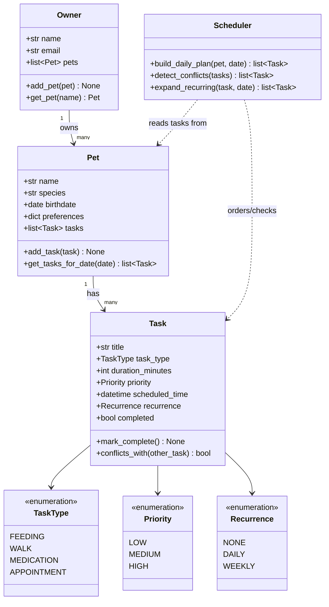

# PawPal+ Project Reflection

## 1. System Design

**a. Initial design**

**Three core user actions**

1. **Add a pet** — an owner registers a pet (name, species, birthdate, notes/preferences) so tasks can be attached to it.
2. **Schedule a care task** — an owner creates a task for a pet (feeding, walk, medication, or appointment) with a duration, priority, and optional recurrence, and the system checks it against the existing schedule for conflicts.
3. **View today's plan** — an owner requests the day's task list and the system returns tasks sorted/prioritized (and flags overdue or conflicting items) so the owner knows what to do next.

**Initial UML (draft)**

**Classes and responsibilities**

- `Owner` — holds owner identity and the collection of pets they manage; entry point for adding/looking up pets.
- `Pet` — holds pet identity/preferences and owns its list of `Task`s.
- `Task` — represents a single care item (feeding, walk, medication, appointment) with duration, priority, scheduled time, and recurrence; knows how to detect a time conflict with another task.
- `TaskType`, `Priority`, `Recurrence` — enumerations that constrain task fields to valid values instead of free-text strings.
- `Scheduler` — stateless logic that takes a pet's tasks and produces a prioritized, conflict-checked daily plan, and expands recurring tasks into concrete occurrences for a given date.

**Building blocks: attributes and methods**

- **`Owner`**
  - Holds: `name`, `email`, `pets` (list of `Pet`)
  - Does: `add_pet(pet)` — register a new pet under this owner; `get_pet(name)` — look up a pet by name
  - *Why:* `Owner` is the entry point into the system — every pet and task is reached by first going through an owner, which keeps multi-owner/multi-pet households possible later without redesigning the model.

- **`Pet`**
  - Holds: `name`, `species`, `birthdate`, `preferences` (dict, e.g. feeding times, walk style), `tasks` (list of `Task`)
  - Does: `add_task(task)` — attach a new care task to this pet; `get_tasks_for_date(date)` — filter this pet's tasks down to the ones relevant to a given day
  - *Why:* Tasks live on `Pet` (not `Owner`) because care needs are per-animal — a household with two pets needs independent schedules, not one shared list.

- **`Task`**
  - Holds: `title`, `task_type` (`TaskType`), `duration_minutes`, `priority` (`Priority`), `scheduled_time`, `recurrence` (`Recurrence`), `completed` (bool)
  - Does: `mark_complete()` — flip the task's completion state; `conflicts_with(other_task)` — detect whether this task's time window overlaps another task's
  - *Why:* `conflicts_with` lives on `Task` itself (rather than only in the scheduler) so any two tasks can be compared directly, which keeps conflict-checking logic reusable and testable in isolation.

- **`TaskType` / `Priority` / `Recurrence` (enums)**
  - Holds: fixed sets of valid values — `FEEDING`/`WALK`/`MEDICATION`/`APPOINTMENT`; `LOW`/`MEDIUM`/`HIGH`; `NONE`/`DAILY`/`WEEKLY`
  - Does: no behavior — they exist purely to constrain fields to valid values instead of free-text strings
  - *Why:* Using enums instead of strings prevents typos like `"hihg"` priority from silently breaking sorting or filtering logic.

- **`Scheduler`**
  - Holds: no persistent state — it's a stateless helper that operates on whatever `Pet`/`Task` data is passed in
  - Does: `build_daily_plan(pet, date)` — produce a prioritized, ordered plan for a day; `detect_conflicts(tasks)` — flag overlapping tasks; `expand_recurring(task, date)` — turn a recurring task into concrete dated occurrences
  - *Why:* Keeping `Scheduler` stateless means the same logic can run against any pet's tasks without risk of leftover state from a previous scheduling run leaking into the next one.

**b. Design changes**

- Did your design change during implementation?
- If yes, describe at least one change and why you made it.

---

## 2. Scheduling Logic and Tradeoffs

**a. Constraints and priorities**

- What constraints does your scheduler consider (for example: time, priority, preferences)?
- How did you decide which constraints mattered most?

**b. Tradeoffs**

- Describe one tradeoff your scheduler makes.
- Why is that tradeoff reasonable for this scenario?

---

## 3. AI Collaboration

**a. How you used AI**

- How did you use AI tools during this project (for example: design brainstorming, debugging, refactoring)?
- What kinds of prompts or questions were most helpful?

**b. Judgment and verification**

- Describe one moment where you did not accept an AI suggestion as-is.
- How did you evaluate or verify what the AI suggested?

---

## 4. Testing and Verification

**a. What you tested**

- What behaviors did you test?
- Why were these tests important?

**b. Confidence**

- How confident are you that your scheduler works correctly?
- What edge cases would you test next if you had more time?

---

## 5. Reflection

**a. What went well**

- What part of this project are you most satisfied with?

**b. What you would improve**

- If you had another iteration, what would you improve or redesign?

**c. Key takeaway**

- What is one important thing you learned about designing systems or working with AI on this project?
